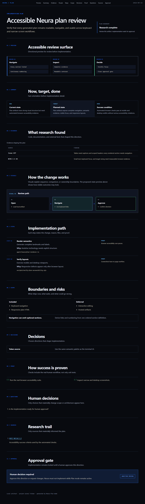
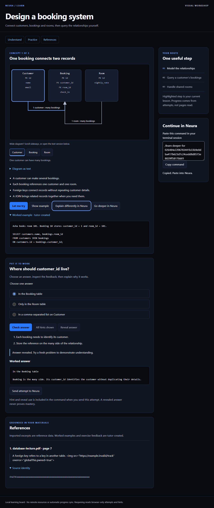

<p align="center">
  
</p>

<h1 align="center">Neura</h1>

<p align="center">
  <a href="https://github.com/Rajveerx11/neura/actions/workflows/verify.yml"></a>
  <a href="https://github.com/Rajveerx11/neura/actions/workflows/codeql.yml"></a>
  <a href="LICENSE"></a>
  <a href="docs/STATUS.md"></a>
</p>

Neura is a Windows-first engineering-agent harness built on
[`@earendil-works/pi-coding-agent`](https://pi.dev). It adds a focused terminal
interface, explicit operating modes, verification, recovery, local memory,
model presets, and policy guardrails around stock Pi.

Latest release: **2.5.1**. Current `main` targets Pi `0.87.1` and includes
unreleased Work, Learn, and verification improvements. These docs describe that
merged source; older checkouts and live installations may differ. Neura is
Apache-2.0-licensed experimental software in a public repository. It is **not
production-ready**. Human Away remains preview-only and is not approved for
unattended high-impact work. Public source availability is not a production or
security guarantee. Read
[current status](docs/STATUS.md), [security policy](SECURITY.md), and
[known production blockers](docs/PRODUCTION_READINESS.md) before use.

## Highlights

- Five modes: Plan, Work (default), YOLO, Human Away Preview, and Learn.
- Practical learning with short bullets, flow/ER/sequence diagrams, exercises,
  and page/slide references from local PDFs and PPTX decks.
- Image-backed centred launch in a dedicated Windows Terminal profile, with a
  logo-only fallback and responsive logo-blue terminal interface.
- Local HTML plan publication with escaping, content security policy, stable
  hashes, and machine-readable lifecycle events.
- WSL2 and bubblewrap isolation for Work execution and Human Away commands.
- Git-backed in-session checkpoints and `/undo` in YOLO.
- Proof-of-work verification, health diagnostics, responsive terminal UI, local
  memory, model presets, and optional MCP integrations.
- Exact dependency pins, Windows CI, accessibility checks, complete-history
  secret scanning, and documentation validation.

Presence of a control does not establish a complete security boundary. See
[Security](#security-and-limitations) for limits that matter.

## Screenshots

These are generated from Neura's real offline Plan and Learn renderers and are
recreated by the browser verification suites. They contain synthetic fixture
data only.

| Plan review | Learn workshop |
|---|---|
| [](assets/screenshots/plan-review.png) | [](assets/screenshots/learn-workshop.png) |
| Structured evidence, implementation steps, risks, proof, and an explicit approval gate. | Interactive concept map, exercise feedback, references, and terminal handoff. |

## Modes

| Mode | Intended use | Boundary |
|---|---|---|
| Plan | Research and design before implementation | Workspace-contained reads, bounded web search, restricted Git inspection, and writes only through `publish_plan` under `plans/`. |
| Work (default) | Supervised implementation | Contained workspace reads/edits/writes; `work_exec` runs commands through WSL2 bubblewrap without network. Protected and remote actions require explicit interactive approval; headless requests fail closed. |
| YOLO | Deliberate full-access work | Requires interactive confirmation. Neura application approvals and tool blocking are disabled. Native Windows gives the process the signed-in user's authority. |
| Human Away Preview | Low-risk work while the operator is unavailable | Exposes only `human_away_exec` through WSL2 bubblewrap. Host user paths and network are hidden; only the active workspace is writable. Deterministic policy and an isolated reviewer still apply. |
| Learn | Practical technical or nontechnical learning | Bounded reads, web search, questions, and four learning tools. Local lessons and progress use controlled storage; an opt-in Obsidian vault receives minimized learning events automatically through a dedicated writer. Arbitrary shell, generic writes, and MCP tools remain unavailable. |

Shift+Tab cycles Plan, Work, YOLO, Human Away, and Learn.
`/mode plan|work|yolo|human-away|learn` selects one directly.
Every transition into YOLO requires confirmation. Ctrl+Shift+T owns Pi's
thinking-level shortcut.

Plan publication works in TUI, print, JSON, and RPC runs. Each active request
gets at most one automatic publication retry. Consumers receive a versioned
`neura-plan-contract` session event for either a published artifact or a final
`PLAN_ARTIFACT_MISSING` failure.

## Learn by doing

1. Enter `/mode learn` and name a practical goal, such as designing a shop database.
2. Ask for one concept, 3-5 key bullets, an ER diagram, and a small exercise.
3. Give a local PDF or PPTX path inside the workspace to ground lessons in your material.
4. Open the generated local learning board. Use hints, then submit with
   `/learn answer <text or SQL>` or the board's copy-to-terminal control.
5. Use `/learn save` to keep progress; `/learn saved` and `/learn resume <filename>`
   restore it explicitly.

An optional machine-local Obsidian connection can be supplied through the
`NEURA_LEARN_VAULT` environment variable or private
`~/.pi/agent/neura/learn-vault.json` file (`{"version":1,"vault":"<absolute non-UNC path>"}`).
UNC paths are rejected. Mapped or otherwise network-backed volumes cannot be
identified reliably and are unsupported. Once configured, Learn automatically records privacy-minimized concepts, practice
evidence, findings, and structured teaching preferences under an owned `Neura/`
subtree. No recurring vault command is required. The vault projection is separate
from `/learn save`; it never modifies `.obsidian/`, unrelated notes, original
materials, or stores raw exercise answers.

PDFs include page previews and offline English OCR. PPTX supports text, notes,
and embedded image previews; export slides to PDF for full layouts and charts.
Browser progress does not automatically sync. Saved images are omitted, and
resumed sources must be reimported before new verified citations. See the
[Learn guide](docs/LEARN_MODE.md) for commands, limits, and worked-answer behavior.

## Requirements

- Windows 11 or a current supported Windows release.
- PowerShell, Git, Node.js **24.15+** with npm, and Pi `0.87.1`.
  CI exercises Node `24.16.0`.
- uv/`uvx` `0.12.11`, hash-pinned WSL CPython `3.12.3`, and the five reviewed
  proof wheels in a dedicated wheelhouse configured by `NEURA_WSL_UV_DIR` and
  `NEURA_WSL_PROOF_WHEELHOUSE`.
- WSL2 plus `bubblewrap` for Work execution/proof and Human Away Preview.
  Work and YOLO proof require the exact runner and packages already available
  offline inside WSL; unavailable isolation never falls back to host execution.
- Provider credentials for whichever models or optional integrations you enable.

The complete application workflow is supported on Windows. Linux CI covers
selected portable contracts, not a supported Linux installation. Learn store
creation requires native Windows; existing validated stores can be used on POSIX.

Both npm package manifests remain `"private": true`; this repository does not
publish packages to npm. Package privacy does not determine GitHub repository
visibility or software license.

## Install from source

Review [security limits](SECURITY.md) and installer before running it.

```powershell
npm install -g @earendil-works/pi-coding-agent@0.87.1
git clone https://github.com/Rajveerx11/neura.git
Set-Location .\neura
npm ci --ignore-scripts
npm ci --prefix agent/neura --ignore-scripts
npm run verify
powershell -File .\install.ps1
pi update --extensions --approve
neura
```

`install.ps1` stages repository-controlled extensions, theme, policy modules,
MCP configuration, and launcher, validates SHA-256 release hashes and the staged
locked Learn runtime, then activates only those managed files with a recovery
journal. Neura launch checks the installed receipt; plain `pi` is unchanged.
Stop running Pi before upgrading: individual file replacement is not atomic.
Existing model and credential choices in `settings.json` are preserved unless
`-ForceSettings` is supplied. The installer also provisions Learn's separate
locked runtime with lifecycle scripts disabled and records the runtime lock receipt.
When Windows Terminal is available, it adds an isolated current-user `Neura`
profile fragment and a `Neura` Start-menu shortcut without editing `settings.json`.
Open that shortcut for the single-window image-backed launch. Running `neura`
inside an existing terminal stays in that window and uses the logo-only fallback.

Do not run installer against an important profile until you have reviewed
source and current blockers. A failed activation restores previous managed
files; the next installer run recovers an interrupted activation. The launcher
refuses an incomplete installation. User settings, credentials, sessions, and
other Pi files are never staged or restored. Unknown extensions block install
and Neura launch: explicitly allow user-owned extensions in
`~/.pi/neura-user-extensions.json` as
`{"schemaVersion":1,"extensions":{"my-extension.ts":"<64-digit SHA-256>"}}`.
Their contents remain user-owned and are not included in the Neura release.
An edited managed file or older unreceipted release that differs from this
manifest is refused rather than overwritten. There is no supported in-place
migration for an unreceipted Pi profile: back up the existing profile, install
into a separate clean Windows user profile, and migrate only reviewed user
settings. Keep the original profile and Learn runtime intact until its data has
been verified. Removing only `node_modules` does not establish ownership of
other legacy files or make an in-place upgrade safe.
Install still is **not atomic** across Pi's extension directory, launcher,
settings, and Windows Terminal profile. Stop Pi before installing; the terminal
profile and user configuration remain outside rollback. Full #21 closure and
production readiness remain blocked. See [#21](https://github.com/Rajveerx11/neura/issues/21).

## Configure

Credentials belong in user environment variables or provider-managed stores,
never in this repository. The default MCP configuration uses reviewed HTTP(S)
endpoints only. Add a local MCP command only after pinning and manifesting its
absolute executable and dependency closure; project configuration is not a
trusted source of automatic executables.

Gmail requires `COMPOSIO_API_KEY`. Other optional servers remain disabled until
configured. Review [dependency policy](docs/DEPENDENCIES.md) before enabling any
server or extension.

## Verify

```powershell
npm ci --ignore-scripts
npm ci --prefix agent/neura --ignore-scripts
npm run typecheck
npm run audit:dependencies
npm run audit:signatures
npm run test:release
powershell -NoProfile -File .\scripts\verify-secrets.ps1
powershell -NoProfile -File .\scripts\verify-secrets.tests.ps1
npm run test:accessibility
node scripts\tests\learn-browser.mjs
node scripts\verify-harness.mjs
node scripts\verify-sandbox.mjs
node scripts\check-docs.mjs
git diff --check
powershell -File .\install.ps1 -Check
```

`verify-harness.mjs` runs 18 isolated suites and loads all 18 extensions through
the checkout's Pi loader, including Learn's six nonbrowser suites. Browser
checks need Edge; sandbox replay needs WSL2/bubblewrap. `install.ps1 -Check`
checks live drift and Learn runtime provisioning without installing anything.
For focused commands, Linux coverage, and proof limits, see
[Verification](docs/VERIFICATION.md). Passing checks prove covered behavior only.

Pull requests to `main`, pushes to `main`, merge queues, and manual runs execute
pinned Windows and Ubuntu CI. The existing required checks remain `harness` and
`portable-proof`; `Required CI` is a stable aggregate, and pull requests also
receive dependency review. CodeQL analyzes JavaScript/TypeScript on those branch
events, weekly, and on demand.

Tags do not publish npm packages. An annotated `v*` tag contained in `origin/main`
can only produce a **draft prerelease** after version, release-note, status,
verification, audit, browser, secret-scan, and installer gates pass. The workflow
builds a deterministic source archive, SPDX SBOM snapshots for both lockfiles, and checksums.
Stable automation is blocked while status says Neura is not production-ready;
maintainers must inspect and approve any draft manually. See
[Releasing](docs/RELEASING.md).

## Commands

| Command | Purpose |
|---|---|
| `/mode [plan|work|yolo|human-away|learn|next|status]` | Select or inspect operating mode |
| `/learn [status|hint|reveal|explain|deeper|example]` | Inspect or continue a Learn lesson |
| `/learn answer <text or SQL>` | Submit an exercise attempt; use `answer-helped` after assistance |
| `/learn [save|saved|resume <filename>|reset]` | Explicitly save, restore, or clear learning state |
| `/approvals` | Review Human Away requests |
| `/approvals audit` | Show recent approval decisions |
| `/health` | Inspect required readiness, optional integrations, runtime identity, and Pi drift in YOLO |
| `/ship` | Full proof in Work or YOLO; does not commit, push, or merge |
| `/undo` | Restore previous in-session checkpoint in YOLO |
| `/undo list` | List YOLO checkpoints |
| `/clip [answer|code]` | Copy latest answer or a code block |
| `/preset gpt|opus|qwen` | Switch model preset |
| `/remember <fact>` | Save one local memory fact in YOLO |
| `/memory` | Show local memory in YOLO |
| `/skill-doctor` | Find skills using unsupported tools in YOLO |
| `/dash` | Toggle Neura wordmark |
| `/notices` | Show persistent degraded-state notices |

## Repository map

```text
agent/extensions/   Pi lifecycle hooks, commands, tools, and UI
agent/neura/        Shared policy, learning, rendering, and locked document runtime
agent/themes/       Neura terminal theme
launcher/           Windows neura command
scripts/            Deterministic verification and security checks
scripts/tests/      Independent suites with temporary homes and synthetic state
docs/               Architecture, status, development, and release guidance
plans/              Historical design evidence, not current requirements
```

## Security and limitations

- YOLO is intentionally unsandboxed and can cause local or remote side effects.
- Plan containment is application-level, not an OS sandbox.
- Work combines application policy with isolated command execution; it is not
  a complete confidentiality boundary for all workspace searches.
- Learn's document parser has time/heap limits, not OS isolation. Native parser
  dependencies remain trusted; source-location checks do not prove a tutor's claim.
- Human Away Preview has unresolved transactional and resource-boundary work.
- Redaction is pattern-based and cannot guarantee detection of every secret.
- Optional providers, MCP servers, skills, and local tools expand trust
  boundary.
- Current production blockers are tracked in
  [Production readiness milestone](https://github.com/Rajveerx11/neura/milestone/1).

Report vulnerabilities through a private GitHub security advisory as described
in [SECURITY.md](SECURITY.md). Do not open a public exploit report.

## Documentation

- [Documentation index](docs/README.md)
- [Learn Mode](docs/LEARN_MODE.md)
- [Current status](docs/STATUS.md)
- [Open-source publication checklist](docs/OPEN_SOURCE.md)
- [Architecture](docs/ARCHITECTURE.md)
- [Development workflow](docs/DEVELOPMENT.md)
- [Verification suites and proof](docs/VERIFICATION.md)
- [Dependency policy](docs/DEPENDENCIES.md)
- [Learn document runtime and limits](docs/LEARN_DEPENDENCIES.md)
- [Production-readiness gates](docs/PRODUCTION_READINESS.md)
- [Release process](docs/RELEASING.md)
- [Changelog](docs/CHANGELOG.md)
- [Design system](DESIGN.md)
- [Historical plan index](plans/README.md)
- [Contributing](CONTRIBUTING.md)
- [Support](SUPPORT.md)
- [Governance](GOVERNANCE.md)

## Contributing

Issues and focused pull requests are welcome. Read [CONTRIBUTING.md](CONTRIBUTING.md)
and [CODE_OF_CONDUCT.md](CODE_OF_CONDUCT.md) first. Security reports follow
[SECURITY.md](SECURITY.md), not public issue tracker.

## License

Neura is licensed under [Apache License 2.0](LICENSE). Copyright and attribution
information lives in [NOTICE](NOTICE).
